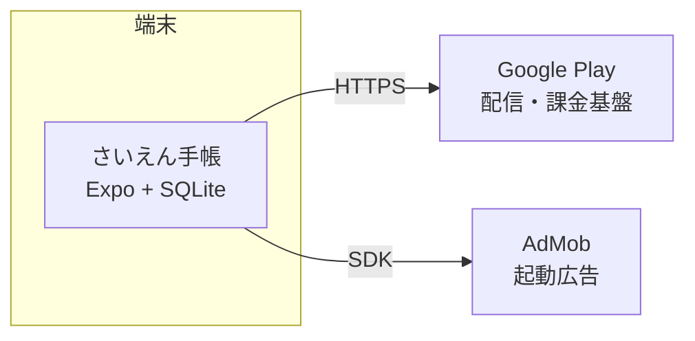
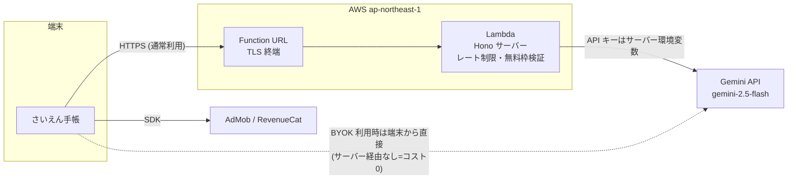

# さいえん手帳 — インフラ・NW 構成設計書

> 作成: 2026-07-28
> ステータス: **レビュー待ち**(承認後に WBS・deploy skill へ反映)
> 設計目標: スケーリング可能な構成で、ランニングコストを可能な限り低減する

---

## 1. 設計方針

1. **ローカルファーストを最大限活かす** — アプリの全コア機能(記録・収穫・アドバイス)は端末内 SQLite で完結する。サーバーが必要なのは AI 推論(v1.5)とクラウド同期(v2.0)のみ。**サーバーの面積を増やさないことが最大のコスト削減策**
2. **アイドルコストゼロ** — 常時起動サーバーを持たず、従量課金のサーバーレスを既定とする(利用ゼロの月は請求ほぼゼロ)
3. **スケールは自動** — サーバーレスの水平スケールに任せ、コスト上限はフリーミアム無料枠+レート制限というアプリ側の設計で制御する(既存実装を踏襲)
4. **可搬性** — サーバーは Hono 製。Node / AWS Lambda / Cloudflare Workers いずれでも動くため、ロックインなく乗り換え可能(`apps/server/src/lambda.ts` のエントリは実装済み)

## 2. フェーズ別構成

### v1.0(ストア公開)— サーバーなし・ランニングコスト ¥0

v1.0 の機能(栽培記録・収穫・栽培暦・次の作業・リマインダー)はすべて端末内で完結する。

- 外部通信は AdMob SDK と Play ストアのみ。自前サーバー・DB・ドメインは**持たない**
- 月額コスト: **¥0**(Play デベロッパー登録は取得済みアカウントを流用)

### v1.5(AI 診断・相談)— AWS Lambda によるサーバーレス推論プロキシ

AI 機能にはサーバーが必要(Gemini API キーの秘匿・無料枠/レート制御)。**AWS Lambda + Function URL(東京 ap-northeast-1)を推奨**。

- **選定理由**(比較は §3): `lambda.ts` が実装済みで移行工数最小。Lambda の恒久無料枠(月 100 万リクエスト・40 万 GB 秒)に収まり、リクエスト課金は実質ゼロ。推論のレイテンシは Gemini 呼び出し(数秒)が支配的で、コールドスタート(1 秒弱)の影響は無視できる
- API Gateway は使わない(Function URL で足りる。固定費・従量費とも削減)
- CDN(CloudFront)も挟まない(API のみで静的配信がないため不要)
- DB は引き続き持たない(サーバーはステートレス、だいどこ設計踏襲)

### v2.0(クラウド同期・家族共有)— 方向性のみ(着手時に詳細設計)

- **写真ストレージ: Cloudflare R2 を第一候補**(エグレス転送料が無料。写真同期はダウンロード量が支配的なため、S3 比でコスト構造が決定的に有利)
- メタデータ DB: Cloudflare D1 または Supabase(無料枠 500MB→Pro $25/月)を着手時に比較
- プッシュ: Expo Push(無料)
- だいどこの `docs/クラウド同期設計.md`(アカウントレス家族同期)と共通化を検討

## 3. 稼働環境の選定比較(v1.5 サーバー)

| 項目 | **AWS Lambda(推奨)** | Railway(だいどこ現行) | Cloudflare Workers |
| --- | --- | --- | --- |
| 課金モデル | 従量(恒久無料枠 100 万 req/月) | 常時起動 約$5/月〜 + 使用量 | 従量(無料 10 万 req/日) |
| アイドルコスト | **¥0** | 約 ¥750/月(固定) | ¥0 |
| 移行工数 | **小**(lambda.ts 実装済み) | ゼロ(現行のまま) | 中(pino 等 Node 依存の互換確認・改修が必要) |
| スケール | 自動(同時実行 1,000 まで既定) | 手動スケール | 自動 |
| コールドスタート | 約 0.5〜1 秒(推論用途では無視可) | なし | ほぼなし |
| リージョン | 東京あり | 東京なし(米国) | エッジ |
| 備考 | AWS アカウント要(Q4) | デプロイ skill が既存 | 将来 R2 併用時に統合しやすい |

**結論(案): v1.5 は AWS Lambda。v2.0 で R2 を採用する際に Workers への統合を再評価する。**

## 4. NW・セキュリティ設計

| 項目 | 設計 |
| --- | --- |
| 通信 | 全通信 HTTPS(TLS1.2+)。Function URL が TLS 終端。平文通信なし |
| エンドポイント | `EXPO_PUBLIC_SERVER_URL` でビルド時注入(実装済み)。カスタムドメイン(例: api.saien-techo.app、年約 ¥1,500〜2,500)は**取得を推奨**(Q2) — Function URL 直書きだと URL 変更=アプリ更新になるため |
| 認証 | v1.5 時点では持たない(だいどこ踏襲)。乱用対策は IP レート制限(実装済み `rate-limit.ts`)+ Gemini 呼び出し回数の日次上限。被害が観測されたら Play Integrity API の導入を検討(将来課題) |
| シークレット | Gemini API キーは Lambda 環境変数(KMS 既定暗号化)。リポジトリ・アプリバイナリには一切埋め込まない。BYOK キーは端末 SecureStore(実装済み) |
| 個人情報 | サーバーはステートレスで保存データなし。推論画像はログに残さない(ログは pino のメタデータのみ)。位置情報は取得しない(要件定義 §9) |
| 監視 | CloudWatch アラーム(エラー率・スロットル)+ **AWS Budgets で月 ¥500 の請求アラート**(コスト暴走の早期検知)。外形監視は UptimeRobot 無料枠 |
| デプロイ | GitHub Actions: main へのリリースタグで Lambda を更新(既存 `deploy-server` skill を Railway 用 → Lambda 用に改訂)。IaC は初期は AWS SAM の最小テンプレート 1 枚(Q3) |

## 5. ランニングコスト試算(月額)

前提: AI 利用者 = MAU の 20%、1 人あたり月 3 回推論(無料枠 1 回/日+広告ボーナスの実効値)。Gemini 2.5 Flash の画像付き推論 1 回 ≈ ¥0.1〜0.5。

| 項目 | v1.0 | v1.5 MAU 1,000 | v1.5 MAU 10,000 | v1.5 MAU 50,000 |
| --- | --- | --- | --- | --- |
| Lambda / Function URL | — | ¥0(無料枠内) | ¥0(無料枠内) | 〜¥300 |
| Gemini API | — | ¥60〜300 | ¥600〜3,000 | ¥3,000〜15,000 |
| ドメイン(取得する場合) | — | 約 ¥150(年額按分) | 約 ¥150 | 約 ¥150 |
| 監視・その他 | ¥0 | ¥0 | ¥0 | ¥0 |
| **合計** | **¥0** | **約 ¥200〜450** | **約 ¥750〜3,150** | **約 ¥3,500〜15,500** |

- Gemini 費用は**収益と同じ方向にスケールする**(AI を使う MAU が増える = 広告・課金収益も増える)うえ、BYOK 利用分はサーバーを経由しないため ¥0
- 参考: Railway 常時起動案は MAU 0 でも月約 ¥750 の固定費が発生する
- 開発インフラ: ビルドはローカル Gradle(既存 `scripts/agent/build-android.mjs`)で **EAS ビルド課金を回避**。CI は GitHub Actions 無料枠(private 2,000 分/月)内

## 6. スケーリング挙動

- **10 倍のスパイク**: Lambda が自動水平スケール(既定同時実行 1,000)。ボトルネックは Gemini API のクォータ → 429 はアプリ側でリトライ・案内表示(既存エラーハンドリング踏襲)
- **コストの上限制御**: ①無料枠(1 回/日)+広告ボーナス上限で 1 ユーザーあたりの推論回数に天井 ②IP レート制限 ③AWS Budgets アラート ④異常時は Lambda の同時実行数を絞って人為的にスロットル(緊急ブレーキ)
- **縮退**: サーバー全停止でもアプリのコア機能(記録・収穫・アドバイス・リマインダー)は無傷(ローカルファーストの利点)。AI ボタンのみエラー表示

## 7. レビューいただきたい点(オープンクエスチョン)

| # | 質問 | 推奨案 |
| --- | --- | --- |
| Q1 | v1.5 サーバーは Lambda 案で良いか(vs Railway 継続 / Cloudflare Workers) | Lambda |
| Q2 | カスタムドメインを取得するか(年 ¥1,500〜2,500。取得するならドメイン名も要決定) | 取得する |
| Q3 | IaC を入れるか(SAM 最小テンプレート vs 手動+手順書) | SAM 最小 |
| Q4 | AWS アカウントは既存を流用するか、さいえん手帳用に新規作成するか(請求分離の観点では新規+Organizations が綺麗だが手間増) | 既存流用+コスト配分タグ |

承認後の反映先: WBS 4.1(AI 実装)の前提タスクとして「インフラ構築(SAM/Lambda/Budgets)」Issue を v1.5 に追加、`deploy-server` skill を Lambda 用に改訂。
