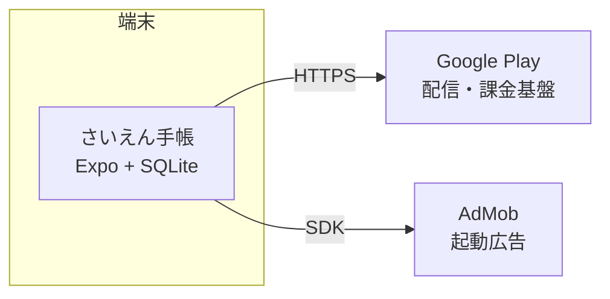
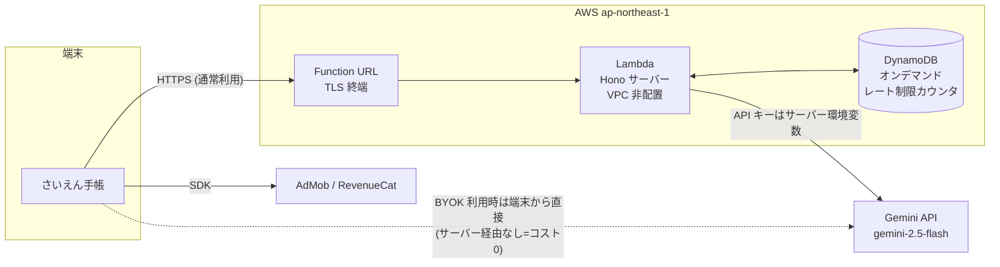

# さいえん手帳 — インフラ・NW 構成設計書

> 作成: 2026-07-28 / 承認: 2026-07-30(レビュー反映済み)
> ステータス: **承認済み**(§7 の決定事項に沿って WBS・deploy skill へ反映する)
> 設計目標: スケーリング可能な構成で、ランニングコストを可能な限り低減する

---

## 1. 設計方針

1. **ローカルファーストを最大限活かす** — アプリの全コア機能(記録・収穫・アドバイス)は端末内 SQLite で完結する。サーバーが必要なのは AI 推論(v1.5)とクラウド同期(v2.0)のみ。**サーバーの面積を増やさないことが最大のコスト削減策**
2. **アイドルコストゼロ** — 常時起動サーバーを持たず、従量課金のサーバーレスを既定とする(利用ゼロの月は請求ほぼゼロ)
3. **スケールは自動** — サーバーレスの水平スケールに任せ、コスト上限はフリーミアム無料枠+レート制限で制御する。ただし**レート制限は水平スケールと両立しないため共有ストアが要る**(§4 認証・§6 参照)
4. **可搬性** — サーバーは Hono 製。Node / AWS Lambda / Cloudflare Workers いずれでも動くため、ロックインなく乗り換え可能(`apps/server/src/lambda.ts` のエントリは実装済み)

## 2. フェーズ別構成

### v1.0(ストア公開)— サーバーなし・ランニングコスト ¥0

v1.0 の機能(栽培記録・収穫・栽培暦・次の作業・リマインダー)はすべて端末内で完結する。

- 外部通信は AdMob SDK と Play ストアのみ。自前サーバー・DB・ドメインは**持たない**
- 月額コスト: **¥0**(Play デベロッパー登録は取得済みアカウントを流用)

### v1.5(AI 診断・相談)— AWS Lambda によるサーバーレス推論プロキシ

AI 機能にはサーバーが必要(Gemini API キーの秘匿・無料枠/レート制御)。**AWS Lambda + Function URL(東京 ap-northeast-1)** で構築する(決定 D1)。

- **選定理由**(比較は §3): `lambda.ts` が実装済みで移行工数最小。Lambda の恒久無料枠(月 100 万リクエスト・40 万 GB 秒)に収まり、リクエスト課金は実質ゼロ。推論のレイテンシは Gemini 呼び出し(数秒)が支配的で、コールドスタート(1 秒弱)の影響は無視できる
- API Gateway は使わない(Function URL で足りる。固定費・従量費とも削減)
- CDN(CloudFront)も挟まない(API のみで静的配信がないため不要)。**カスタムドメインは取得しない決定(D2)のため前段は不要** — 将来ドメインを付ける場合は Function URL に直接ドメインを割り当てられないので、そのとき CloudFront をオリジン前段に追加する
- **Lambda は VPC に配置しない** — VPC に入れると外部 API 到達に NAT Gateway が必要になり月 $32〜 の固定費が発生し、「アイドルコストゼロ」の前提が崩れる
- **DynamoDB(オンデマンド)をレート制限カウンタにのみ使う** — 業務データは持たない(サーバーはステートレスのまま)。理由は §4 認証を参照。無料枠(25GB・月 200 万リクエスト)内で実質 ¥0

#### Lambda 固有の制約と対応(実装時の必須対応)

| 制約                                       | 影響                                                                                                                        | 対応                                                                                                                                                   |
| ------------------------------------------ | --------------------------------------------------------------------------------------------------------------------------- | ------------------------------------------------------------------------------------------------------------------------------------------------------ |
| プロセス内メモリは実行環境ごとに独立       | `rate-limit.ts` の日次上限が実行環境数だけ多重化し、コールドスタートでリセットされる。**コスト天井が実質機能しない**        | カウンタを DynamoDB の共有ストアへ(§4 認証)。移行までは予約同時実行 1〜2 で暫定的に上限を作る                                                          |
| 同期呼び出しのリクエストペイロード上限 6MB | `infer.ts` の `MAX_IMAGE_BASE64_LENGTH = 8_000_000`(≈6MB デコード)は上限を超えうる。Hono 到達前に弾かれ不透明なエラーになる | サーバー側の宣言値を 4,000,000 文字程度へ下げて整合させる。端末側は `image-preprocess.service.ts` が既定 2MB/1200px に圧縮するため通常運用では影響なし |

### v2.0(クラウド同期・家族共有)— 方向性のみ(着手時に詳細設計)

- **写真ストレージ: Cloudflare R2 を第一候補**(エグレス転送料が無料。写真同期はダウンロード量が支配的なため、S3 比でコスト構造が決定的に有利)
- メタデータ DB: Cloudflare D1 または Supabase(無料枠 500MB→Pro $25/月)を着手時に比較
- プッシュ: Expo Push(無料)
- だいどこの `docs/クラウド同期設計.md`(アカウントレス家族同期)と共通化を検討

## 3. 稼働環境の選定比較(v1.5 サーバー)

| 項目             | **AWS Lambda(推奨)**             | Railway(だいどこ現行)       | Cloudflare Workers                          |
| ---------------- | -------------------------------- | --------------------------- | ------------------------------------------- |
| 課金モデル       | 従量(恒久無料枠 100 万 req/月)   | 常時起動 約$5/月〜 + 使用量 | 従量(無料 10 万 req/日)                     |
| アイドルコスト   | **¥0**                           | 約 ¥750/月(固定)            | ¥0                                          |
| 移行工数         | **小**(lambda.ts 実装済み)       | ゼロ(現行のまま)            | 中(pino 等 Node 依存の互換確認・改修が必要) |
| スケール         | 自動(同時実行 1,000 まで既定)    | 手動スケール                | 自動                                        |
| コールドスタート | 約 0.5〜1 秒(推論用途では無視可) | なし                        | ほぼなし                                    |
| リージョン       | 東京あり                         | 東京なし(米国)              | エッジ                                      |
| 備考             | AWS アカウント要(D4 で新規作成)  | デプロイ skill が既存       | 将来 R2 併用時に統合しやすい                |

**結論(決定 D1): v1.5 は AWS Lambda。v2.0 で R2 を採用する際に Workers への統合を再評価する。**

## 4. NW・セキュリティ設計

| 項目           | 設計                                                                                                                                                                                                                                                                                                                                                                                                                                                                                                                |
| -------------- | ------------------------------------------------------------------------------------------------------------------------------------------------------------------------------------------------------------------------------------------------------------------------------------------------------------------------------------------------------------------------------------------------------------------------------------------------------------------------------------------------------------------- |
| 通信           | 全通信 HTTPS(TLS1.2+)。Function URL が TLS 終端。平文通信なし                                                                                                                                                                                                                                                                                                                                                                                                                                                       |
| エンドポイント | `EXPO_PUBLIC_SERVER_URL` でビルド時注入(実装済み)。**カスタムドメインは取得しない(決定 D2)** — Function URL を直接注入する。URL 変更にはアプリ更新(ストア審査)が必要になるため、**Function URL は再作成せず維持する運用**を前提とする。将来ドメインが必要になったら CloudFront を前段に追加する(Function URL には直接割り当てられない)                                                                                                                                                                              |
| 認証           | v1.5 時点では持たない(だいどこ踏襲)。乱用対策は日次レート制限 + Gemini 呼び出し回数の日次上限。**ただし現行 `rate-limit.ts` はプロセス内 Map で、Lambda の水平スケールでは上限が実行環境数だけ多重化して機能しない**(docstring にも「shared store が必要」と明記済み)。**DynamoDB オンデマンドを共有カウンタとして追加し、`INFER_GLOBAL_DAILY_LIMIT` を実効化することを v1.5 の必須実装とする**。移行完了までは予約同時実行 1〜2 で物理的に上限を作る。被害が観測されたら Play Integrity API の導入を検討(将来課題) |
| シークレット   | Gemini API キーは Lambda 環境変数(KMS 既定暗号化)。リポジトリ・アプリバイナリには一切埋め込まない。BYOK キーは端末 SecureStore(実装済み)                                                                                                                                                                                                                                                                                                                                                                            |
| 個人情報       | 自サーバーはステートレスで保存データなし。推論画像はログに残さない(ログは pino のメタデータのみ)。位置情報は取得しない(要件定義 §9)。**推論画像は Google(Gemini API)へ送信される** — 無料枠と有料枠でプロンプト/画像の学習利用ポリシーが異なるため、**どちらの枠を使うかを実装時に確定し、プライバシーポリシーと Play データセーフティ申告へ反映する**(WBS 3.8 / 3.9 と連動)                                                                                                                                        |
| 監視           | CloudWatch アラーム(エラー率・スロットル)+ **AWS Budgets で月 ¥500 の請求アラート**(コスト暴走の早期検知)。外形監視は UptimeRobot 無料枠                                                                                                                                                                                                                                                                                                                                                                            |
| デプロイ       | GitHub Actions: main へのリリースタグで Lambda を更新(既存 `deploy-server` skill を Railway 用 → Lambda 用に改訂)。IaC は **AWS SAM の最小テンプレート 1 枚(決定 D3)** — Lambda / Function URL / DynamoDB / Budgets / CloudWatch アラームを 1 ファイルで管理する                                                                                                                                                                                                                                                    |

## 5. ランニングコスト試算(月額)

前提: AI 利用者 = MAU の 20%、1 人あたり月 3 回推論(無料枠 1 回/日+広告ボーナスの実効値)。Gemini 2.5 Flash の画像付き推論 1 回 ≈ ¥0.1〜0.5。

| 項目                         | v1.0   | v1.5 MAU 1,000  | v1.5 MAU 10,000    | v1.5 MAU 50,000       |
| ---------------------------- | ------ | --------------- | ------------------ | --------------------- |
| Lambda / Function URL        | —      | ¥0(無料枠内)    | ¥0(無料枠内)       | ¥0(無料枠内)          |
| DynamoDB(レート制限カウンタ) | —      | ¥0(無料枠内)    | ¥0(無料枠内)       | ¥0(無料枠内)          |
| Gemini API                   | —      | ¥60〜300        | ¥600〜3,000        | ¥3,000〜15,000        |
| 監視・その他                 | ¥0     | ¥0              | ¥0                 | ¥0                    |
| **合計**                     | **¥0** | **約 ¥60〜300** | **約 ¥600〜3,000** | **約 ¥3,000〜15,000** |

- **前提: AWS アカウントはさいえん手帳専用(決定 D4)** — Lambda / DynamoDB / CloudWatch の常時無料枠を他ワークロードと共有しないため、上表の「無料枠内」がそのまま成立する
- Lambda の GB 秒: MAU 50,000(月 30,000 推論)でも 1 回 5 秒 × 512MB 換算で約 75,000 GB 秒。無料枠 400,000 GB 秒の 2 割程度に収まる
- カスタムドメインは取得しない決定(D2)のためドメイン費用は発生しない
- Gemini 費用は**収益と同じ方向にスケールする**(AI を使う MAU が増える = 広告・課金収益も増える)うえ、BYOK 利用分はサーバーを経由しないため ¥0
- Gemini の単価は変動するため、実装着手時(WBS 4.1)に再確認する
- 参考: Railway 常時起動案は MAU 0 でも月約 ¥750 の固定費が発生する
- 開発インフラ: ビルドはローカル Gradle(既存 `scripts/agent/build-android.mjs`)で **EAS ビルド課金を回避**。CI は GitHub Actions 無料枠(private 2,000 分/月)内

## 6. スケーリング挙動

- **10 倍のスパイク**: Lambda が自動水平スケール(既定同時実行 1,000)。ボトルネックは Gemini API のクォータ → 429 はアプリ側でリトライ・案内表示(既存エラーハンドリング踏襲)
- **コストの上限制御**: ①無料枠(1 回/日)+広告ボーナス上限で 1 ユーザーあたりの推論回数に天井 ②**DynamoDB 共有カウンタによる日次グローバル上限**(`INFER_GLOBAL_DAILY_LIMIT`)— これが実コスト天井。プロセス内カウンタのままでは Lambda で機能しない点に注意 ③AWS Budgets アラート ④異常時は Lambda の予約同時実行数を絞って人為的にスロットル(緊急ブレーキ。②の実装前はこれが唯一の物理的な上限)
- **縮退**: サーバー全停止でもアプリのコア機能(記録・収穫・アドバイス・リマインダー)は無傷(ローカルファーストの利点)。AI ボタンのみエラー表示

## 7. 決定事項(2026-07-30 レビュー完了)

| #   | 論点                    | 決定                                                                                              |
| --- | ----------------------- | ------------------------------------------------------------------------------------------------- |
| D1  | v1.5 サーバーの稼働環境 | **AWS Lambda + Function URL(東京)**。Railway からの移行は v1.5 着手時                             |
| D2  | カスタムドメイン        | **取得しない**。Function URL を `EXPO_PUBLIC_SERVER_URL` に直接注入し、URL を変えない運用にする   |
| D3  | IaC                     | **AWS SAM の最小テンプレート 1 枚**で Lambda / Function URL / DynamoDB / Budgets / アラームを管理 |
| D4  | AWS アカウント          | **さいえん手帳用に新規作成**。請求・無料枠・障害影響範囲を分離する                                |

### レビュー指摘の反映(2026-07-30)

| 指摘                                                                                 | 反映先                                                                  |
| ------------------------------------------------------------------------------------ | ----------------------------------------------------------------------- |
| `rate-limit.ts` はプロセス内 Map で、Lambda の水平スケールではコスト天井が機能しない | §2 制約表・§4 認証・§6 に DynamoDB 共有カウンタを必須実装として追加     |
| Function URL にカスタムドメインは直接割り当てられない                                | §2・§4 に明記(D2 でドメイン取得しないため当面は影響なし)                |
| `MAX_IMAGE_BASE64_LENGTH`(≈6MB)が Lambda のペイロード上限 6MB と競合                 | §2 制約表に 4,000,000 文字への引き下げを追加                            |
| Gemini 側のデータ扱いが未記載                                                        | §4 個人情報に学習利用ポリシーの確定とデータセーフティ申告への反映を追加 |
| VPC 配置時の NAT Gateway 固定費                                                      | §2 に「VPC 非配置」を明記                                               |
| 無料枠は AWS アカウント単位                                                          | D4(新規作成)で専有。§5 に前提として明記                                 |

## 8. 反映先(この設計書の承認を受けて実施すること)

1. **WBS へ Issue 追加** — v1.5(WBS 4.1 AI 実装)の前提タスクとして「インフラ構築(SAM / Lambda / Function URL / DynamoDB / Budgets)」
2. **サーバー改修 Issue** — ①`rate-limit.ts` を共有ストア対応にリファクタ ②`infer.ts` の `MAX_IMAGE_BASE64_LENGTH` を 4,000,000 へ
3. **`deploy-server` skill の改訂** — Railway 用 → Lambda(SAM デプロイ)用
4. **AWS アカウント新規作成**(D4)— Budgets の請求アラートを最初に設定する
5. **プライバシーポリシー・データセーフティ** — Gemini の利用枠確定後に WBS 3.8 / 3.9 へ反映
